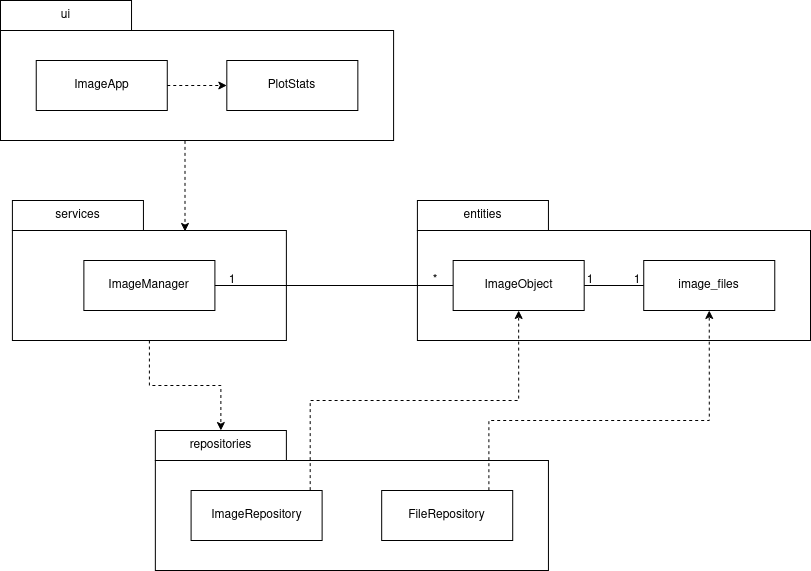
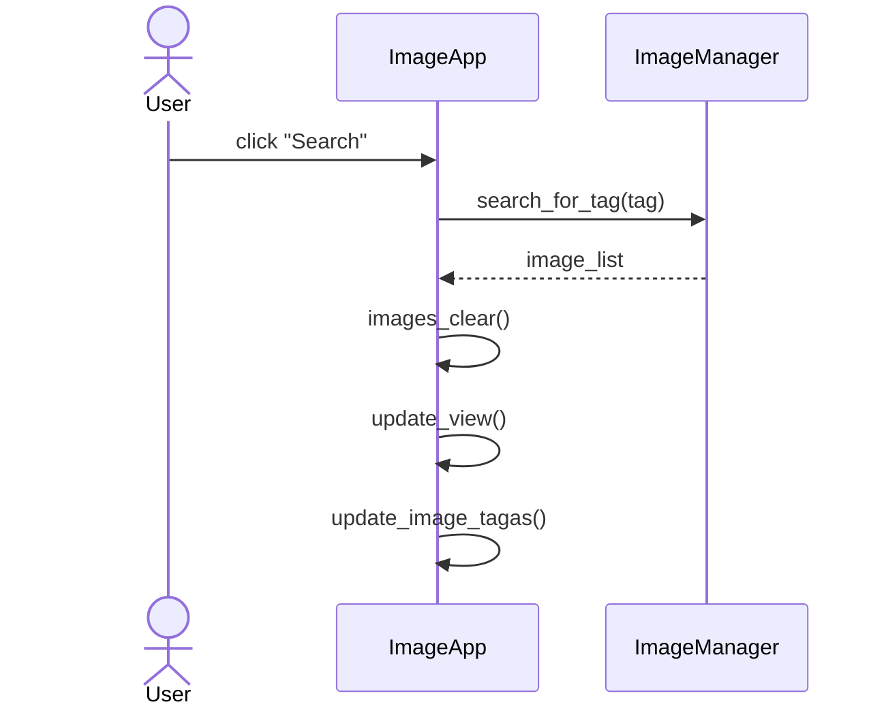

# Arkkitehtuurikuvaus

Dokumentti sisältää sovelluksen korkean tason (esim. hakemistojen tasolla) rakenteen kuvauksen, sekä alustavan kuvauksen sovelluslogiikasta

## Hakemistorakenne:

- ui
  - ImageApp: luokka vastaa käyttöliittymästä
  - PlotStats: luokka vastaa kaavioiden piirämisestä saamastaan datasta
  
 - services
    - ImageManager: luokka vastaa sovelluslogiikasta ja käsittelee entities hakemiston olioita ja tiedostoja repository hakemiston luokkien avulla
 
 - entities
    - ImageObject: tietomalli, joka pitää sisällään kuva-olioiden käsittelyyn tarvittavat tiedot (id, nimi, tagit, kuvatiedosto)
    - image_files: hakemisto kuvatiedostoille, jotka kuuluvat kuvaolioille
  
- repositries
  - ImageRepository: luokka vastaa tietokantaan tallennettujen kuvaolioiden tietojen käsittelystä
  - FileRepository: luokka vastaa tiedtoihin tallennettujen kuvaolioiden tietojen käsittelystä

- data
  - image_metadata.json: JSON-tiedosto, johon tallennetaan kuvaolioiden dataa (nimi ja tagit). Datan avulla voidaan alustaa tietokantaan tarvittavat tiedot kuvaolioiden muodostamisa ja käsittelyä varten.
  - image_data.db: sqlite3-tietokanta, jossa säilytetään kuvaolioiden dataa. 

## Kuvaus sovelluslogiikasta

ImageObject olioihin on tallennettu tietoja, joita käsitellään ImageManager luokan metodien avulla. Id toimii kuvaolion yskilöivänä tunnisteena. Nimi, on itsessa kuvatiedoston nimi, jonka avulla muodostetaan polku tiedostojärjestelmässä sijaistsevaan kuvatiedostoon, joka sitten avatataan ja säilötään kuvaolioon. 

Kuvaolioon säilöttäviä tietoja, joista id, nimi ja tagit ovat tietokannassa, ja kuvatiedosto, joka sijaitsee tiedostojärjestelmässä, käsitellään ImageRepository ja FileRepository luokkien avulla.

Myös kuvatiedostot olisi voinut tallentaa tietokantaan, mikä olisi yksinkertaistanut totetutusta. On kuitenkin useita skenaarioita, joissa kuvatiedstojen tallentaminen erikseen tiedostojärjestelmään ja kuvien metadatan tallennus tietokantaan on järkevämpää. Tässä tapauksessa halusin vain harjoitella hieman kompleksisemman ratkaisun toteutusta.   

## Alustava luokka-/pakkauskaavio (ei ajantasalla!)

## Sekvenssikaavio: kuvien etsiminen tagilla

