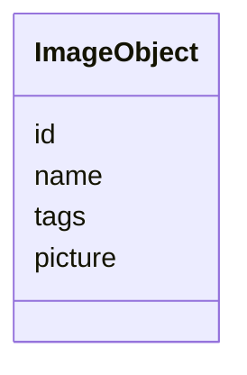
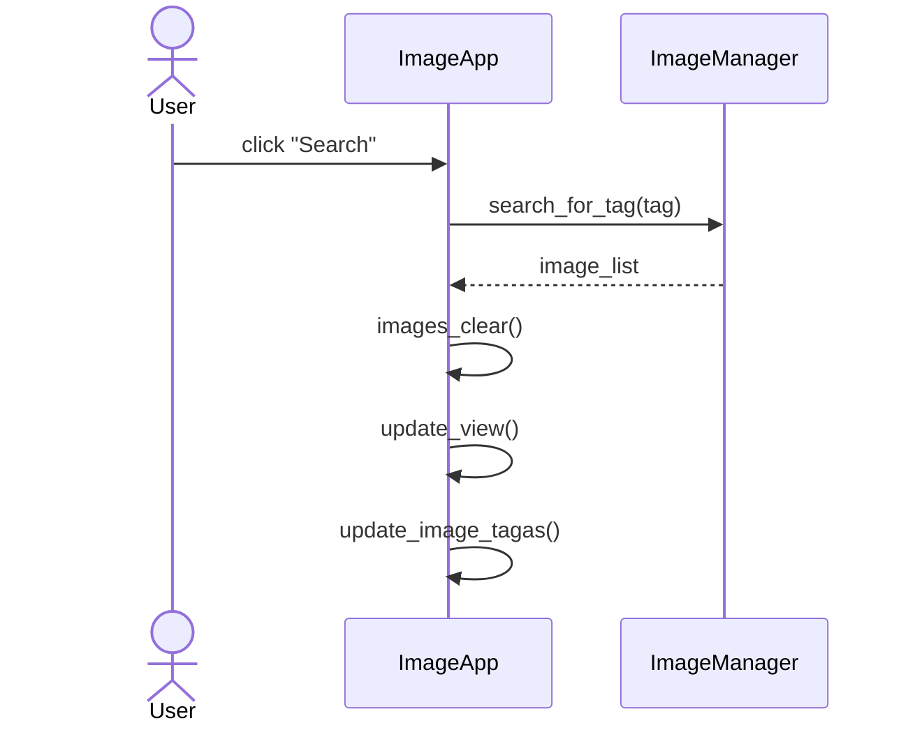

# Arkkitehtuurikuvaus

## Rakenne
Ohjelman rakenne on kolmitasoinen kerrosarkkitehtuuri ja sen luokka/pakkauskaavio on seuraava:

Pakkaus **ui** sisältää käyttöliittymästä, **services** sovelluslogiikasta ja **repositories** tietojen pysyväistallennuksesta vastaavan koodin. Pakkaus **entities** sisältää luokan ja tiedostoja, jotka vastaavat sovelluksen käyttämistä tietokohteista.

## Käyttöliittymä

Pakkaus **ui** koostuu seuraavista luokista:
- ImageApp: luokka vastaa käyttöliittymästä
- PlotStats: luokka vastaa kaavioiden piirämisestä saamastaan datasta

Käyttöliittymä on eristetetty sovelluslogiikasta ja kutsuu vain ImageManager ja PlotStats luokkien metodeja.

Käynnistettäessä sovellus ImageApp-luokka kutsuu ImageManager luokan metodeja, jotka alustavan tietokannan ja lataavat siihen konfiguraatiotiedostoissa määriteltyä dataa. Käyttöliittymässä on kolme erilaista kuvanäkymää: *Load Images*, *Search Results* ja *All Images*. Tieto missä näkymässä ollaan, säilytetään luokan `current_view` atribuutissa. Jos käyttäjä siityy *All Images* näkymään, ladataan tiedot uudelleen tietokannasta keskusmuistiin.

## Sovelluslogiikka

Sovelluksen loogisen tietomallin muodostaa luokka ImageObject, joka kuvaa mitä tietoja kuvaolioilla on:

ImageObject olioiden käsittelystä vastaa ImageManager luokka, joka tarjoaa erilaisia metodeja niiden käsittelyyn:
- `get_all_images` 
- `search_for_tag(tag)` 
- `add_tag(image, tag)`
- `delete_tag(image, tag)`
- `tag_statistics()`
- `save_tag_changes(image_list)`
- `save_image(image_list)`     

- services
    - ImageManager: luokka vastaa sovelluslogiikasta ja käsittelee entities hakemiston olioita ja tiedostoja repository hakemiston luokkien avulla

### Kuvaus sovelluslogiikasta

ImageObject olioihin on tallennettu tietoja, joita käsitellään ImageManager luokan metodien avulla. Id toimii kuvaolion yskilöivänä tunnisteena. Nimi, on itsessa kuvatiedoston nimi, jonka avulla muodostetaan polku tiedostojärjestelmässä sijaistsevaan kuvatiedostoon, joka sitten avatataan ja säilötään kuvaolioon. 

Kuvaolioon säilöttäviä tietoja, joista id, nimi ja tagit ovat tietokannassa, ja kuvatiedosto, joka sijaitsee tiedostojärjestelmässä, käsitellään ImageRepository ja FileRepository luokkien avulla.

## Tietojen tallennus
 - entities
    - ImageObject: tietomalli, joka pitää sisällään kuva-olioiden käsittelyyn tarvittavat tiedot (id, nimi, tagit, kuvatiedosto)
    - image_files: hakemisto kuvatiedostoille, jotka kuuluvat kuvaolioille
  
- repositries
  - ImageRepository: luokka vastaa tietokantaan tallennettujen kuvaolioiden tietojen käsittelystä
  - FileRepository: luokka vastaa tiedtoihin tallennettujen kuvaolioiden tietojen käsittelystä

- data
  - image_metadata.json: JSON-tiedosto, johon tallennetaan kuvaolioiden dataa (nimi ja tagit). Datan avulla voidaan alustaa tietokantaan tarvittavat tiedot kuvaolioiden muodostamisa ja käsittelyä varten.
  - image_data.db: sqlite3-tietokanta, jossa säilytetään kuvaolioiden dataa. 

## Päätoiminnallisuudet

### Sekvenssikaavio: kuvien etsiminen tagilla

### Muut toiminnallisuudet

## Ohjelman rakekenteeseen jääneet heikkoudet

Myös kuvatiedostot olisi voinut tallentaa tietokantaan, mikä olisi yksinkertaistanut totetutusta. On kuitenkin useita skenaarioita, joissa kuvatiedstojen tallentaminen erikseen tiedostojärjestelmään ja kuvien metadatan tallennus tietokantaan on järkevämpää. Tässä tapauksessa halusin vain harjoitella hieman kompleksisemman ratkaisun toteutusta.   
