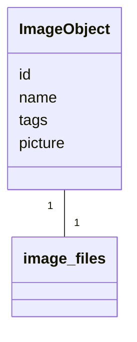
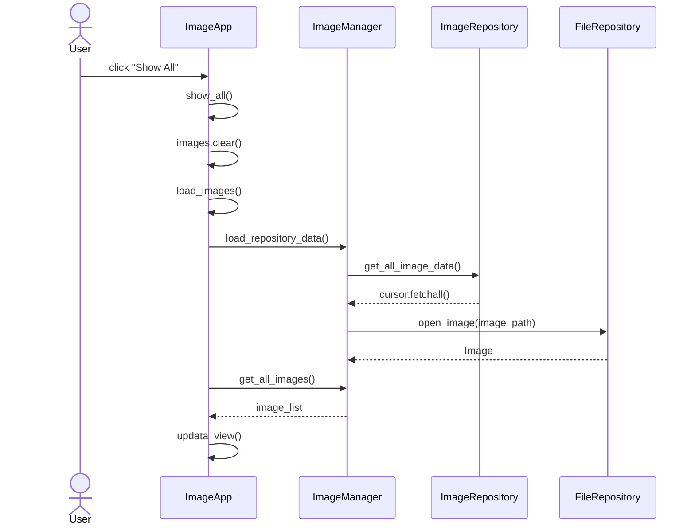
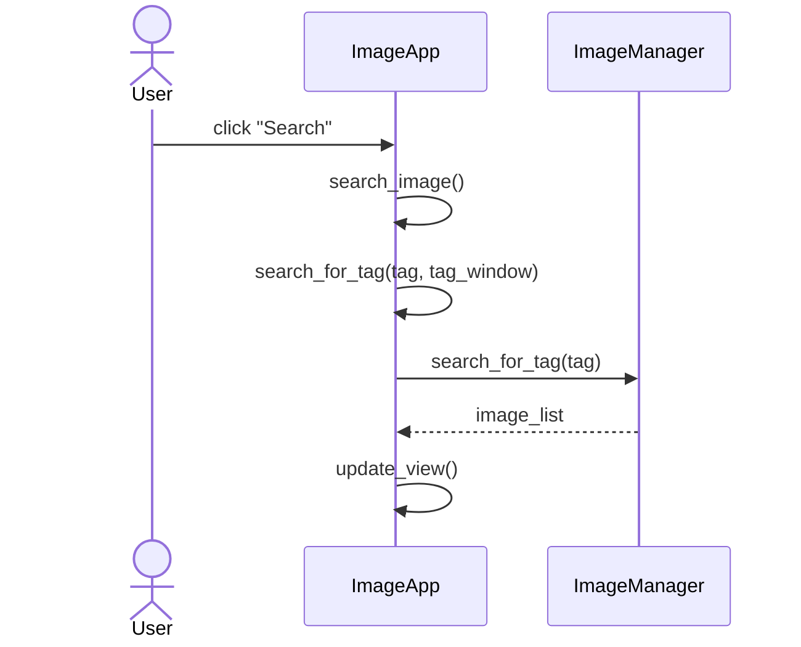
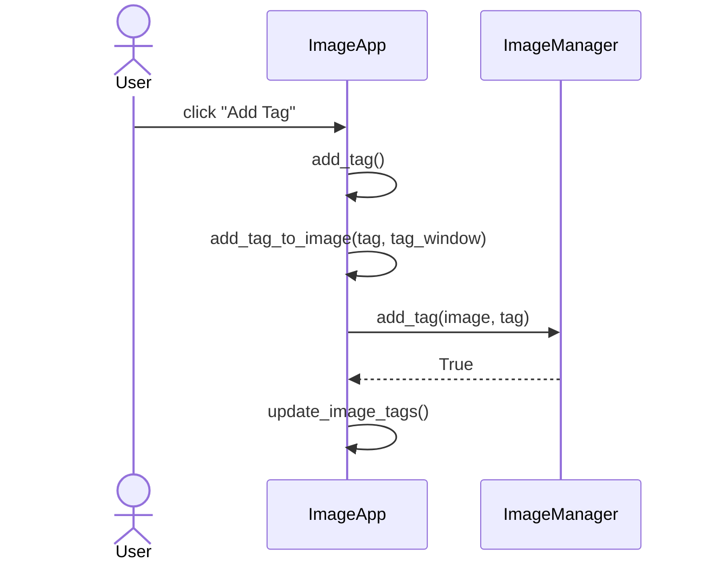

# Arkkitehtuurikuvaus

## Rakenne
Ohjelman rakenne on kolmitasoinen kerrosarkkitehtuuri ja sen luokka/pakkauskaavio on seuraava:

Pakkaus **ui** sisältää käyttöliittymästä, **services** sovelluslogiikasta ja **repositories** tietojen pysyväistallennuksesta vastaavan koodin. Pakkaus **entities** sisältää luokan ja tiedostoja, jotka vastaavat sovelluksen käyttämistä tietokohteista.

## Käyttöliittymä

Pakkaus **ui** koostuu seuraavista luokista:
- ImageApp: luokka vastaa käyttöliittymästä
- PlotStats: luokka vastaa kaavioiden piirämisestä saamastaan datasta

Käyttöliittymä on eristetetty sovelluslogiikasta ja kutsuu vain ImageManager ja PlotStats luokkien metodeja.

Käynnistettäessä sovellus ImageApp-luokka kutsuu ImageManager luokan metodeja, jotka alustavan tietokannan ja lataavat siihen konfiguraatiotiedostoissa määriteltyä dataa. Käyttöliittymässä on kolme erilaista kuvanäkymää: *Load Images*, *Search Results* ja *All Images*. Tieto missä näkymässä ollaan, säilytetään luokan `current_view` atribuutissa. Jos käyttäjä siityy *All Images* näkymään, ladataan tiedot uudelleen tietokannasta keskusmuistiin.

## Sovelluslogiikka

Sovelluksen loogisen tietomallin muodostaa luokka ImageObject, joka kuvaa mitä tietoja kuvaolioilla on:

`id`  toimii kuvaolion yskilöivänä tunnisteena. `name` on kuvatiedoston nimi, jonka avulla muodostetaan polku tiedostojärjestelmässä sijaistsevaan kuvatiedostoon, joka sitten avatataan ja säilötään atribuuttiin `picture`. `tags` pitää sisällään listan kuvaan liityvistä tageista. ImageObject olioiden mudostamisesta sekä niiden atribuuttien käsittelystä vastaa ImageManager luokka, joka tarjoaa erilaisia metodeja käsittelyyn:

- `load_repository_data()` 
- `load_image_from_file(image_paths)` 
- `get_all_images()` 
- `search_for_tag(tag)` 
- `add_tag(image, tag)`
- `delete_tag(image, tag)`
- `tag_statistics()`
- `save_tag_changes(image_list)`
- `save_image(image_list)`     

Lisäksi luokassa on metod `load_json_to_db()`, joka alustaa tietokannan ja lataa siihen dataa JSON-muotoisesta konfiguraatiotiedostosta. 

*ImageManager* käsittelee *ImageObject* olioiden tietoja pakkauksessa repositories olevien *ImageRepository* ja *FileRepository* luokkien kautta, jotka injektoidaan konstrutorikutsun yhteydessä.

## Tietojen tallennus

Kuvaolio tiedoista `id`, `name` ja `tags` tallennetaa SQLite-tietokantaan ja niiden ksäittelystä vastaa `ImageRepository` luokka. Sen sijaan `picture`, joka on itse kuvatiedosto, sijaitsee tiedostojärjestelmässä ja käsittelystä vastaa `FileRepository` luokka.

Tallennuksessa on hyödynnetty Repository-suunnittelumallia jolloin datan tallenustapaa on mahdollista tarvittaessa vaihtaa. Sovelluksen ollessa käynnissä data ladataan ja tallennetaan keskusmuistiin. Datan käsittely tapahtuu myös keskusmuistissa kunnes käyttäjä päättää itse tallentaa muutokset tai haluaa siirtyä *All Images* näkymään, jolloin data haetaan uudelleen repositorioista keskusmuistiin.

### Tiedostot

Sovelluksen käyttämät kuvatiedostot sijaisetvat *entities* pakkauksen `image_files` hakemistossa. Jos käyttäjä lisää uusia kuvia, tallennetaan ne samaan hakemistoon.

Sovelluksen käynnistyessä tietokanta populoidaan `image_metadata.json` nimiseen JSON-tiedostostoon tallennettujen tietojen (tiedoston nimi ja tagit) perusteella. JSON-tiedosto ja SQLite tietokanta tallennetaan ohjelman juuressa sijaisevaan *data* hakemistoon. Sovelluksen käyttämät hakemistopolut ja tiedostonimet määritellään ohjelman juuressa sijaisevassa *config.py* tiedostossa.

## Päätoiminnallisuudet

### Kaikkien kuvien näyttäminen

### Uuden kuvan lisääminen

### Kuvien etsiminen tagilla

### Tagin lisääminen

### Muut toiminnallisuudet

Tilastojen näyttäminen

## Ohjelman rakekenteeseen jääneet heikkoudet

Myös kuvatiedostot olisi voinut tallentaa tietokantaan, mikä olisi yksinkertaistanut totetutusta. On kuitenkin useita skenaarioita, joissa kuvatiedstojen tallentaminen erikseen tiedostojärjestelmään ja kuvien metadatan tallennus tietokantaan on järkevämpää. Tässä tapauksessa halusin vain harjoitella hieman kompleksisemman ratkaisun toteutusta.   
