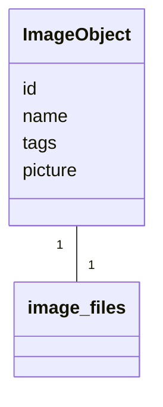
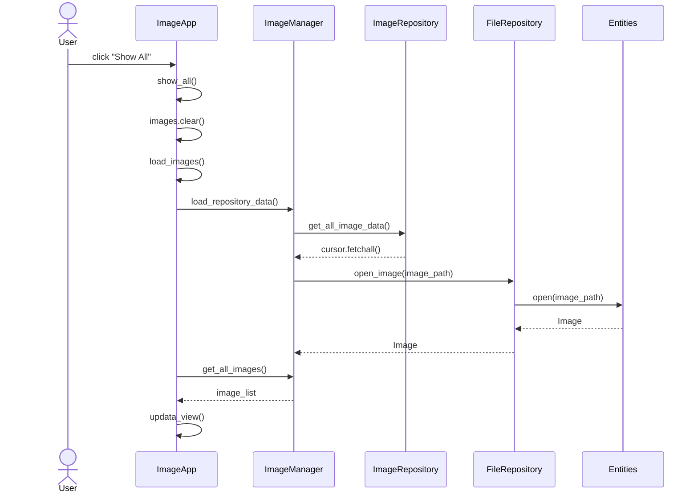
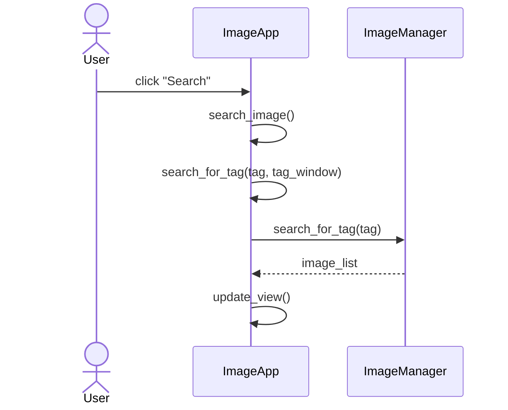
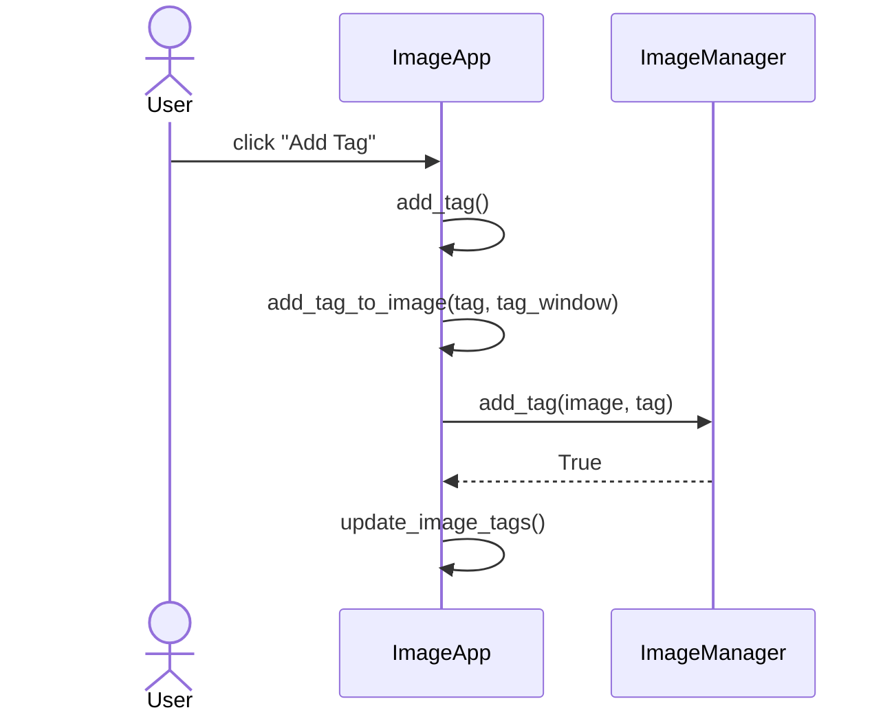
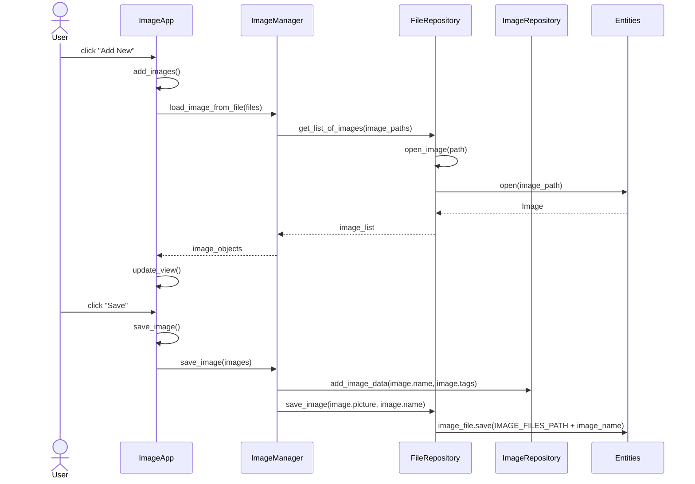

# Arkkitehtuurikuvaus

## Rakenne
Ohjelman rakenne on kolmitasoinen kerrosarkkitehtuuri ja sen luokka/pakkauskaavio on seuraava:

Pakkaus **ui** sisältää käyttöliittymästä, **services** sovelluslogiikasta ja **repositories** tietojen pysyväistallennuksesta vastaavan koodin. Pakkaus **entities** sisältää luokan ja tiedostoja, jotka vastaavat sovelluksen käyttämistä tietokohteista.

## Käyttöliittymä

Pakkaus **ui** koostuu seuraavista luokista:
- [ImageApp](../src/ui/image_app.py): luokka vastaa käyttöliittymästä
- [PlotStats](../src/ui/plot_stats.py): luokka vastaa kaavioiden piirämisestä saamastaan datasta

Käyttöliittymä on eristetetty sovelluslogiikasta ja kutsuu vain `ImageManager` ja `PlotStats` luokkien metodeja.

Käynnistettäessä sovellus `ImageApp`-luokka kutsuu `ImageManager` luokan metodeja, jotka alustavat tietokannan ja lataavat siihen konfiguraatiotiedostoissa määriteltyä dataa. Käyttöliittymässä on kolme erilaista kuvanäkymää: *Load Images*, *Search Results* ja *All Images*. Tieto missä näkymässä ollaan, säilytetään luokan `current_view` attribuutissa. Jos käyttäjä siityy *All Images* näkymään, ladataan tiedot uudelleen tietokannasta keskusmuistiin.

## Sovelluslogiikka

Sovelluksen loogisen tietomallin muodostaa luokka [ImageObject](../src/entities/image_object.py), joka kuvaa mitä tietoja kuvaolioilla on:

`id`  toimii kuvaolion yskilöivänä tunnisteena. `name` on kuvatiedoston nimi, jonka avulla muodostetaan polku tiedostojärjestelmässä sijaistsevaan kuvatiedostoon, joka sitten avatataan ja säilötään atribuuttiin `picture`. `tags` pitää sisällään listan kuvaan liityvistä tageista. `ImageObject` olioiden mudostamisesta sekä niiden attribuuttien käsittelystä vastaa `ImageManager` luokka, joka tarjoaa erilaisia metodeja käsittelyyn:

- `load_repository_data()` 
- `load_image_from_file(image_paths)` 
- `get_all_images()` 
- `search_for_tag(tag)` 
- `add_tag(image, tag)`
- `delete_tag(image, tag)`
- `tag_statistics()`
- `save_tag_changes(image_list)`
- `save_image(image_list)`     

Lisäksi luokassa on metod `load_json_to_db()`, joka alustaa tietokannan ja lataa siihen dataa JSON-muotoisesta konfiguraatiotiedostosta. 

`ImageManager` käsittelee `ImageObject` olioiden tietoja pakkauksessa repositories olevien [ImageRepository](../src/repositories/image_repository.py) ja [FileRepository](../src/repositories/file_repository.py) luokkien kautta, jotka injektoidaan konstrutorikutsun yhteydessä.

## Tietojen tallennus

Kuvaolion attribuuteista `id`, `name` ja `tags` tallennetaa SQLite-tietokantaan ja niiden ksäittelystä vastaa [ImageRepository](../src/repositories/image_repository.py) luokka. Sen sijaan attribuutti `picture`, joka on itse kuvatiedosto, sijaitsee tiedostojärjestelmässä ja käsittelystä vastaa [FileRepository](../src/repositories/file_repository.py) luokka.

Tallennuksessa on hyödynnetty Repository-suunnittelumallia jolloin datan tallenustapaa on mahdollista tarvittaessa vaihtaa. Sovelluksen ollessa käynnissä data ladataan ja tallennetaan keskusmuistiin. Datan käsittely tapahtuu myös keskusmuistissa kunnes käyttäjä päättää itse tallentaa muutokset tai haluaa siirtyä *All Images* näkymään, jolloin data haetaan uudelleen repositorioista keskusmuistiin.

### Tiedostot

Sovelluksen käyttämät kuvatiedostot sijaisetvat *entities* pakkauksen `image_files` hakemistossa. Jos käyttäjä lisää uusia kuvia, tallennetaan ne samaan hakemistoon.

Sovelluksen käynnistyessä tietokanta populoidaan [image_metadata.json](../src/data/image_metadata.json) nimiseen JSON-tiedostostoon tallennettujen tietojen (tiedoston nimi ja tagit) perusteella. JSON-tiedosto ja SQLite tietokanta tallennetaan ohjelman juuressa sijaisevaan *data* hakemistoon. Sovelluksen käyttämät hakemistopolut ja tiedostonimet määritellään ohjelman juuressa sijaisevassa [config.py](../src/config.py) tiedostossa.

## Päätoiminnallisuudet

### Kaikkien kuvien näyttäminen

### Kuvien etsiminen tagilla

### Tagin lisääminen

### Uuden kuvan lisääminen ja tallentaminen

### Muut toiminnallisuudet

Sekvenssikaavioissa on jätetty kuvaamatta kuvien selaaminen eteen- ja taaksepäin, tilastojen näyttäminen sekä konfiguraatiotiedoston tallennus lopetettaessa ohjelman käyttö, koska ne ovat toiminintoina melko yksinkertaisa.

Tagin poistaminen toimii samalla tavalla kuin tagin lisääminen. Jos uusia kuvia ei ole haluttu lisätä, niin tallennettaessa kuvia ei tallenneta hakemistoon. Tagimuutokset päivitetään tietokontaan kuvan id:n perustella.

## Ohjelman rakekenteeseen jääneet heikkoudet

### Käyttöliittymä

Käyttöliittymän komponenttien muodostaminen ja toiminnallisuuksista vastaavata metodit ovat samassa luokkassa, minkä seurauksena luokassa on turhan paljon koodia. Komponenttien muodostamiset ja toiminnallisuuksia olisi voinut koota yhteen ja jakaa omiin luokkiinsa. Pylint huomauttaakin että `ImageApp` luokassa on liian monta instanssiattribuuttia.

Käyttäjän antamien syötteiden tarkistus tehdään pääosin käyttöliittymässä. On hieman makuasia, että olisiko ollut parempi tehdä tarkastaminen sovelluslogiikan puolella. Tämän seurauksena metodeissa on jonkin verran toisteista koodia esimerkiksi käyttäjälle annettavien viestien muodossa, vaikka *Single Responsibility* periaate totetuukin melko hyvin toteutuksissa.

Edellisistä johtuen kaikki painikkeet ovat yhdessä ja samassa pääikkunassa, mikä vaikuttaa sovelluksen käytettävyyteen, jos toiminnallisuuksia halutaan lisätä. Tästäkin syystä toiminnallisuudet kannattaisi jakaa omiin ikkunoihinsa tai valikkoihin.

### Sovellulogiikka

Tietoja käsitellään keskusmuistissa paitsi silloin, jos käyttäjä haluaa päivittää näkymään kaikki kuvat, jolloin tiedot haetaan uudelleen repositoroista tietokantaan. Järkevämpää ehkä olisi, että tietoja käsitellään keskusmuistissa koko ajan ja muutokset tallennetaan vain jos käyttäjä niin nimenomaan haluaa.

Luokkien välistä tiedonvälitystä olisi voinut selkeyttää luokkien paremmalla kapseloinnilla/abstraktoinnilla. Nyt luokat välisessä kommunikoinnissa metodien väliset parametrit vaihtelevat hieman eri tapauksissa. Olisi selkeämpää, jos luokkien välillä välitettäisiin esimerkiksi vain ImageObject olidoita tai niiden atribuutteja. Osittain vaihtelevat käytänteet johtuvat siitä, että kuvatiedostot tallennetaan tiedostojärjestelmään ja muu data tietokantaan. 

### Tietojen tallennus

Myös kuvatiedostot olisi voinut tallentaa tietokantaan, mikä olisi yksinkertaistanut totetutusta ja selkeyttänyt luokkien välistä kommunikointia. On kuitenkin useita skenaarioita, joissa kuvatiedstojen tallentaminen tiedostojärjestelmään ja kuvien metadatan tallennus tietokantaan on järkevämpää. 

Toteutusta ja luokkien välistä kommunikointia olisi selkeyttänyt myös, jos tagit olisi tallennettu omaan tauluunsa tietokantaan merkkijonon sijaan ja kuvan id:tä olisi käytetty avaimena.
