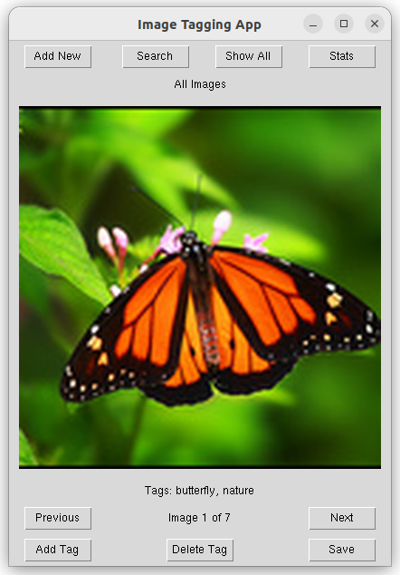
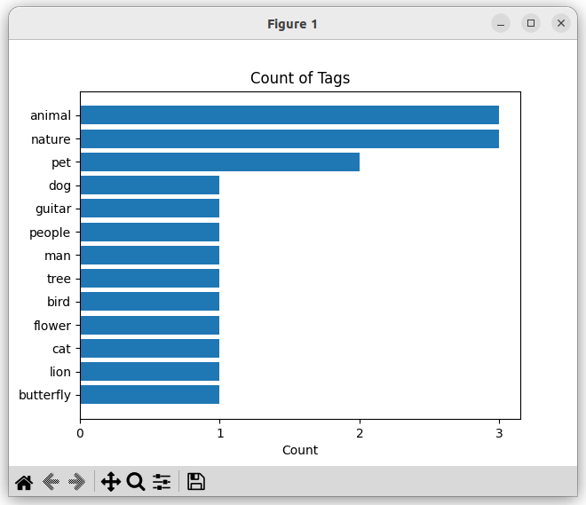
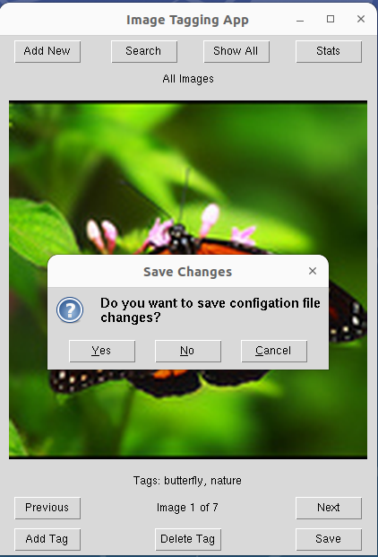

## Käyttöohje

Kun ohjelma käynnistetään komennolla "poetry run invoke start", ladataan automaattisesti tietokantaan julkaisun mukana tulleita testikuvia. 

Käyttöliittymässä on kolme eri näkymää kuvien selausta ja tagien muokkausta varten: 
- Show All: näyttää kaikki tietokannassa olevat kuvat
- Serach: tag-haun avulla löytyneet kuvat
- Add New: paikallisesti lisätyty uude kuvat.

### Add New

Uusien kuvien lisäys pakallisesta hakemistosta tapahtuu **Add New** painikkeen avulla. Oletusravoisesti avautuu hakemisto, jossa on valmiiksi kolme testikuvaa, joita ei ole lisätty tietokantaan. Kerralla voi lisätä yhden tai useammaan kuvan.

Näkymässä voi selata kuvia ja muokata (lisätä tai poistaa) niiden tageja. Jos kuvat ja mahdolliset tagit haluaa tallentaa tietokantaan, täytyy painaa **Save** painiketta. Jos tallenusta ei tee ja siirtyy toiseen näkumään (Search/Show All), uudet kuvat menetetään.

### Search

Kuvia voi hakea tageilla **Searh** painikkeen avulle. Tällöin näkymään tulevat hakua vastaavat kuvat, joita voi selailla ja muokata tageja. Jos haluaa, säilyttää tageihin tehdyt muutokset, täytyy muutokset tallentaa **Save** painikkeen avulla.

### Show All

**Show All** painike näyttää kaikki talletetut kuvat. Jos kuvien tageihin tehdään muutoksia ja muutokset haluaa säilyttää, täytyy painaa **Save** painiketta.

### Stats

**Stats** painiketta painamalla avautuu uusi ikkuna, joka näyttää pylväsdiagrammin eri tagien lukumääristä.

### Add Tag & Delete Tag

**Add Tag** painikkeesta avautuu ikkuna johon voi lisätä uusia tageja. Lisättävällä tagilla ei ole muita rajoituksi kuin että se **ei voi sisältää pilkkua**. 

**Delete Tag** painikkeesta avautuu ikkuna, josta voi poistaa tageja. Tagit ovat listana, josta voi valita yksi kerrallaan poistettavan tagin.

### Ohjelman lopetus

Ohjelman lopetus tapahtuu sulkemalla ikkuna. Ennen ikkunan sulkemista käyttäjältä kysytään haluaako hän tallentaa mahdolliset muutokset. Jos käyttäjä vastaa "Yes", tallennetaan kuvien metadata (kuvatiedoston nimi ja tagit) JSON-konfiguraatiotiedostoon, josta data taas ladataan tietokantaan kun ohjlema käynnistetään uudelleen.

