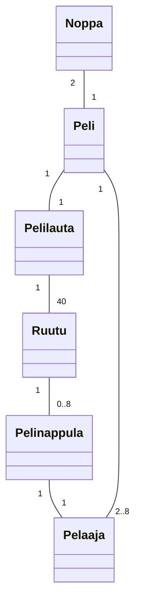
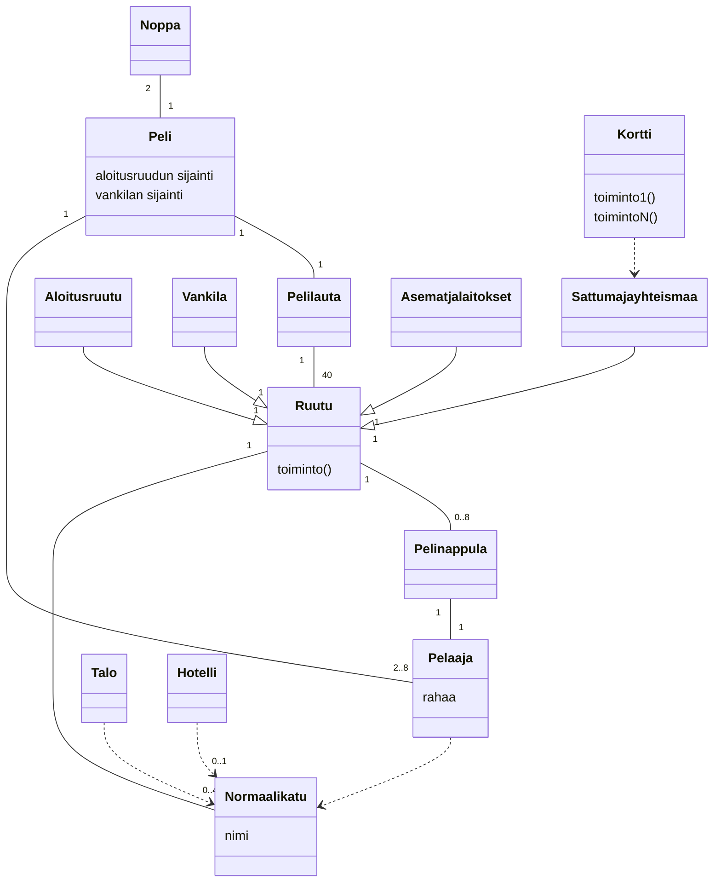
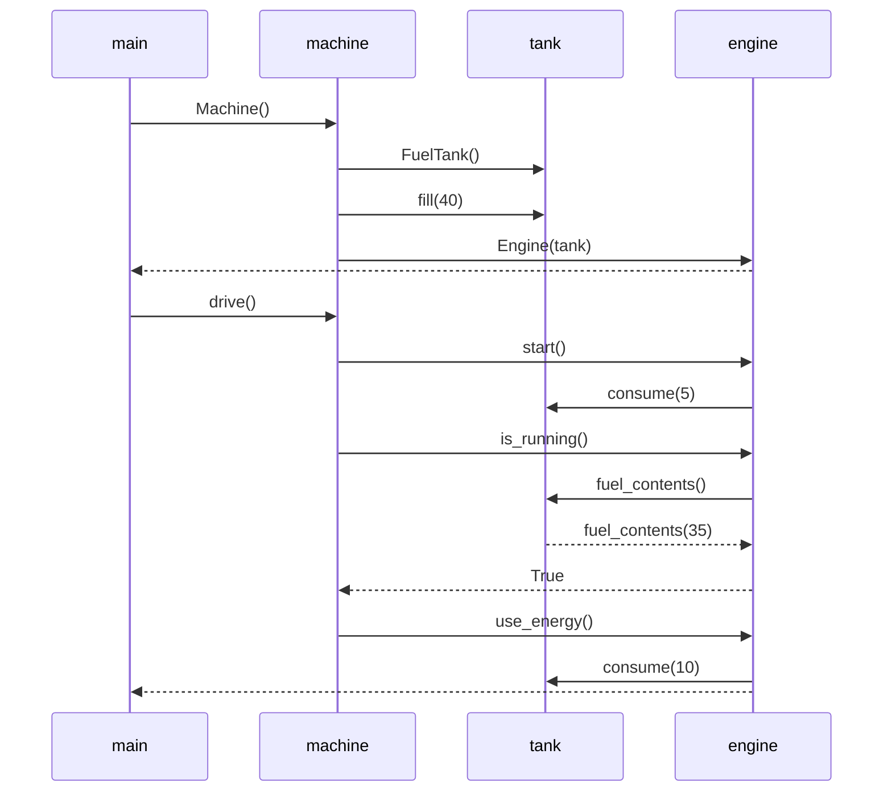
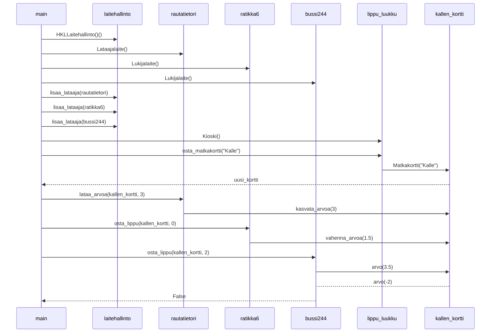

### Tehtävä 1: Monopoli

```mermaid

classDiagram 
    Noppa "2"-- "1" Peli
    Peli "1" -- "1" Pelilauta
    Pelilauta "1" -- "40" Ruutu
    Ruutu "1" -- "0..8" Pelinappula
    Pelinappula "1" -- "1" Pelaaja
    Pelaaja "2..8" -- "1" Peli
```

### Tehtävä 2: Laajennttu Monopoli

```mermaid

classDiagram 
    Noppa "2"-- "1" Peli
    Peli "1" -- "1" Pelilauta
    Pelilauta "1" -- "40" Ruutu
    Ruutu "1" -- "0..8" Pelinappula
    Pelinappula "1" -- "1" Pelaaja
    Pelaaja "2..8" -- "1" Peli
    Aloitusruutu --|> "1" Ruutu
    Vankila --|> "1" Ruutu
    Sattuma ja yhteismaa --|> "1" Ruutu
    Asemat ja laitokset --|> "1" Ruutu
    Normaali katu -- "1" Ruutu
    Kortti ..> Sattuma ja yhteismaa
    Talo ..> "0..4" Normaali katu
    Hotelli ..> "0..1" Normaali katu
    Pelaaja ..> Normaali katu

    class Peli{
        aloitusruudun sijainti
        vankilan sijainti
    }
    class Ruutu{
        toiminto()
    }
    class Kortti{
        toiminto1()
        toimintoN()
    }
    class Normaali katu{
        nimi
    }
    class Pelaaja{
        rahaa
    }

```

### Tehtävä 3: Sekvenssikaavio

```mermaid
sequenceDiagram
    main ->> machine: Machine()
    machine ->> tank: FuelTank()
    machine ->> tank: fill(40)
    machine ->> engine: Engine(tank)
    engine -->> main: 
    main ->> machine: drive()
    machine ->> engine: start()
    engine ->> tank: consume(5)
    machine ->> engine: is_running()
    engine ->> tank: fuel_contents()
    tank -->> engine: fuel_contents(35)
    engine -->> machine: True
    machine ->> engine: use_energy()
    engine ->> tank: consume(10)
    engine -->> main: 

```

### Tehtävä 4: Laajempi Sekvenssikaavio

```mermaid
sequenceDiagram
    main ->> laitehallinto: HKLLaitehallinto()()
    main ->> rautatietori: Lataajalaite()
    main ->> ratikka6: Lukijalaite()
    main ->> bussi244: Lukijalaite()
    
    main ->> laitehallinto: lisaa_lataaja(rautatietori)
    main ->> laitehallinto: lisaa_lataaja(ratikka6)
    main ->> laitehallinto: lisaa_lataaja(bussi244)

    main ->> lippu_luukku: Kioski()
    main ->> lippu_luukku: osta_matkakortti("Kalle")
    lippu_luukku ->> kallen_kortti: Matkakortti("Kalle")
    kallen_kortti-->> main: uusi_kortti
    
    main ->> rautatietori: lataa_arvoa(kallen_kortti, 3)
    rautatietori ->> kallen_kortti: kasvata_arvoa(3)
    
    main ->> ratikka6: osta_lippu(kallen_kortti, 0)
    ratikka6 ->> kallen_kortti: vahenna_arvoa(1.5)

    main ->> bussi244: osta_lippu(kallen_kortti, 2)
    bussi244 ->> kallen_kortti: arvo(3.5)
    kallen_kortti --> bussi244: arvo(-2)
    bussi244 -->> main: False


```