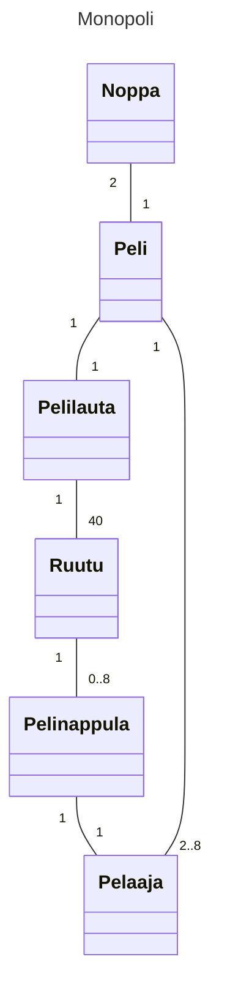
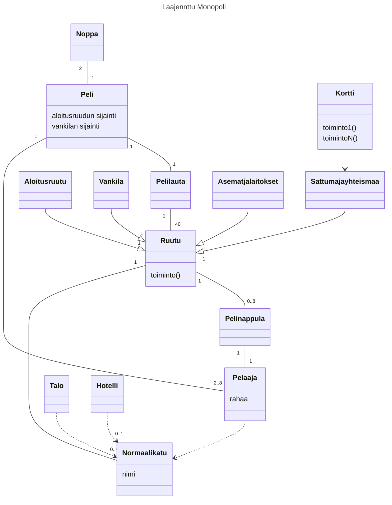

```mermaid
---
title: Monopoli
---
classDiagram 
    Noppa "2"-- "1" Peli
    Peli "1" -- "1" Pelilauta
    Pelilauta "1" -- "40" Ruutu
    Ruutu "1" -- "0..8" Pelinappula
    Pelinappula "1" -- "1" Pelaaja
    Pelaaja "2..8" -- "1" Peli
```

```mermaid
---
title: Laajennttu Monopoli
---
classDiagram 
    Noppa "2"-- "1" Peli
    Peli "1" -- "1" Pelilauta
    Pelilauta "1" -- "40" Ruutu
    Ruutu "1" -- "0..8" Pelinappula
    Pelinappula "1" -- "1" Pelaaja
    Pelaaja "2..8" -- "1" Peli
    Aloitusruutu --|> "1" Ruutu
    Vankila --|> "1" Ruutu
    Sattuma ja yhteismaa --|> "1" Ruutu
    Asemat ja laitokset --|> "1" Ruutu
    Normaali katu -- "1" Ruutu
    Kortti ..> Sattuma ja yhteismaa
    Talo ..> "0..4" Normaali katu
    Hotelli ..> "0..1" Normaali katu
    Pelaaja ..> Normaali katu

    class Peli{
        aloitusruudun sijainti
        vankilan sijainti
    }
    class Ruutu{
        toiminto()
    }
    class Kortti{
        toiminto1()
        toimintoN()
    }
    class Normaali katu{
        nimi
    }
    class Pelaaja{
        rahaa
    }

```